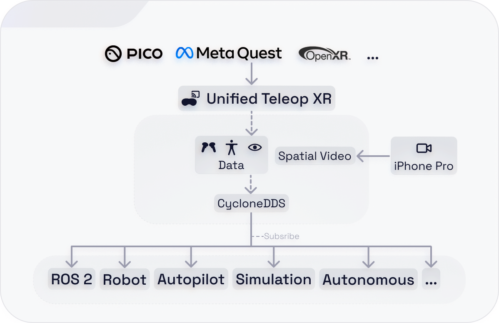
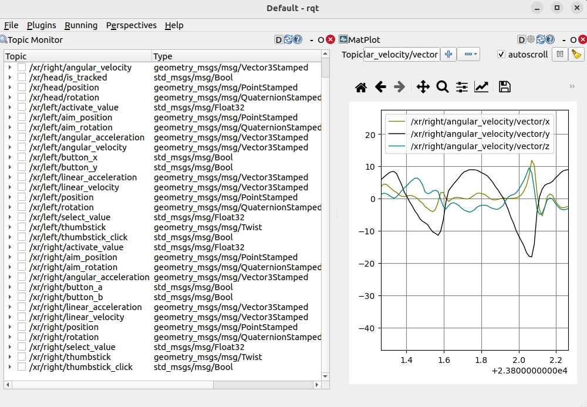
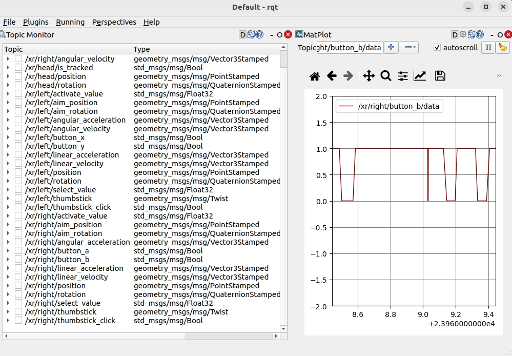

# Unified Teleop XR

[English](#en) | [中文](#cn)
<a id="en"></a>
Unified Teleop XR publishes XR input data directly as DDS/ROS 2 topic streams. Launch the app, connect the XR device and receiver to the same network, and subscribe to the data stream.

XR development ❌ TCP/ROS bridge ❌ ROS 2 package ❌

DDS/ROS 2 data stream ✅ Android standalone ✅ PCVR ✅

Unified Teleop XR is a lightweight Unity toolkit for using XR devices as controllers for teleoperation and remote interaction. It streams pose, velocity, acceleration, and interaction data using OpenXR and CycloneDDS. It has been used for robot teleoperation, robotic-arm manipulation, remote assistance, HRI research, egocentric data collection, and deep-learning workflows.

## How It Works

A robot, ROS 2 node, simulator, or native DDS application on the same network can subscribe to the published data directly.



## Data

### Raw Output

<details>
<summary><b>Head</b></summary>
<pre>
/xr/head/is_tracked                         std_msgs/msg/Bool<br>/xr/head/position                           geometry_msgs/msg/PointStamped<br>/xr/head/rotation                           geometry_msgs/msg/QuaternionStamped
</pre>
</details>

<details>
<summary><b>Left / Right Hand</b></summary>
<pre>
/xr/left/is_tracked                         std_msgs/msg/Bool<br>/xr/left/position                           geometry_msgs/msg/PointStamped<br>/xr/left/rotation                           geometry_msgs/msg/QuaternionStamped<br>/xr/left/linear_velocity                    geometry_msgs/msg/Vector3Stamped<br>/xr/left/angular_velocity                   geometry_msgs/msg/Vector3Stamped<br>/xr/left/linear_acceleration                geometry_msgs/msg/Vector3Stamped<br>/xr/left/angular_acceleration               geometry_msgs/msg/Vector3Stamped<br>/xr/right/is_tracked                        std_msgs/msg/Bool<br>/xr/right/position                          geometry_msgs/msg/PointStamped<br>/xr/right/rotation                          geometry_msgs/msg/QuaternionStamped<br>/xr/right/linear_velocity                   geometry_msgs/msg/Vector3Stamped<br>/xr/right/angular_velocity                  geometry_msgs/msg/Vector3Stamped<br>/xr/right/linear_acceleration               geometry_msgs/msg/Vector3Stamped<br>/xr/right/angular_acceleration              geometry_msgs/msg/Vector3Stamped
</pre>
</details>

<details>
<summary><b>Controller Input</b></summary>
<pre>
/xr/left/activate_value                     std_msgs/msg/Float32<br>/xr/left/select_value                       std_msgs/msg/Float32<br>/xr/left/thumbstick                         geometry_msgs/msg/Twist<br>/xr/left/thumbstick_click                   std_msgs/msg/Bool<br>/xr/left/primary_button                     std_msgs/msg/Bool<br>/xr/left/secondary_button                   std_msgs/msg/Bool<br>/xr/right/activate_value                    std_msgs/msg/Float32<br>/xr/right/select_value                      std_msgs/msg/Float32<br>/xr/right/thumbstick                        geometry_msgs/msg/Twist<br>/xr/right/thumbstick_click                  std_msgs/msg/Bool<br>/xr/right/primary_button                    std_msgs/msg/Bool<br>/xr/right/secondary_button                  std_msgs/msg/Bool
</pre>
</details>

<details>
<summary><b>Hand Joints</b></summary>
<pre>
[To Be Done]
</pre>
</details>

<details>
<summary><b>Body</b></summary>
<pre>
/xr/chest/pose                              geometry_msgs/msg/PoseStamped<br>/xr/left_shoulder/pose                      geometry_msgs/msg/PoseStamped<br>/xr/right_shoulder/pose                     geometry_msgs/msg/PoseStamped<br>/xr/left_elbow/pose                         geometry_msgs/msg/PoseStamped<br>/xr/right_elbow/pose                        geometry_msgs/msg/PoseStamped<br>/xr/hip/pose                                geometry_msgs/msg/PoseStamped<br>/xr/left_knee/pose                          geometry_msgs/msg/PoseStamped<br>/xr/right_knee/pose                         geometry_msgs/msg/PoseStamped<br>/xr/left_ankle/pose                         geometry_msgs/msg/PoseStamped<br>/xr/right_ankle/pose                        geometry_msgs/msg/PoseStamped<br>/xr/left_foot/pose                          geometry_msgs/msg/PoseStamped<br>/xr/right_foot/pose                         geometry_msgs/msg/PoseStamped
</pre>
</details>

<details>
<summary><b>Eyes</b></summary>
<pre>
/xr/eyes/is_tracked                         std_msgs/msg/Bool<br>/xr/eyes/gaze_position                      geometry_msgs/msg/PointStamped<br>/xr/eyes/gaze_rotation                      geometry_msgs/msg/QuaternionStamped
</pre>
</details>

<details>
<summary><b>Interaction</b></summary>
<pre>
/xr/left/aim_position                       geometry_msgs/msg/PointStamped<br>/xr/left/aim_rotation                       geometry_msgs/msg/QuaternionStamped<br>/xr/right/aim_position                      geometry_msgs/msg/PointStamped<br>/xr/right/aim_rotation                      geometry_msgs/msg/QuaternionStamped<br>/xr/left/select                             std_msgs/msg/Bool<br>/xr/right/select                            std_msgs/msg/Bool<br>/xr/left/select_value                       std_msgs/msg/Float32<br>/xr/right/select_value                      std_msgs/msg/Float32<br>/xr/left/activate                           std_msgs/msg/Bool<br>/xr/right/activate                          std_msgs/msg/Bool<br>/xr/left/activate_value                     std_msgs/msg/Float32<br>/xr/right/activate_value                    std_msgs/msg/Float32<br>/xr/left/ui_press                           std_msgs/msg/Bool<br>/xr/right/ui_press                          std_msgs/msg/Bool<br>/xr/left/ui_scroll                          geometry_msgs/msg/Vector3<br>/xr/right/ui_scroll                         geometry_msgs/msg/Vector3
</pre>
</details>

<div style="display:flex; gap:10px;">
  
  
</div>

### Safeguard Mode

Safeguard mode applies safety post-processing to raw OpenXR input data, primarily the left and right controller/hand poses. It is designed to reduce unsafe or invalid output when:

- Controller or hand tracking is lost during operation.
- A controller is dropped to the floor.
- Hand/controller motion exceeds a configured human-motion limit.
- A controller is left stationary somewhere and should no longer be treated as being held.

## GPU-Reconstructed Spatial Video

An iPhone Pro RGB-D stream can be transmitted over Wi-Fi and reconstructed as spatial video for point-cloud or mesh visualization. Reconstruction runs in GPU compute shaders to minimize CPU overhead.

Place an iPhone Pro at the remote site to share a spatial view of the environment and preserve a sense of distance between the camera and surrounding objects. This can improve spatial awareness during teleoperation.

## Supported Devices

- Meta Quest 3
- Meta Quest 3S
- Meta Quest Pro
- Meta Quest 2
- PICO 4 Ultra
- PICO 4 / PICO 4 Pro / Enterprise

<details><summary>More On The Way</summary>
PCVR<br>
Meta VR Glasses<br>
PICO Space Pro<br>
SteamVR<br>
HTC VIVE Focus<br>
HTC VIVE XR Elite<br>
Valve Index<br>
HTC VIVE Pro / Pro 2<br>
PS VR2<br>
</details>

## Quick Start

```
1. Install the APK
2. Open Unified Teleop XR
3. Put the headset and receiver on the same network
4. Subscribe through DDS / ROS 2
```

For questions, suggestions, or support, open an issue or email [rob.bingru.li@outlook.com](mailto:rob.bingru.li@outlook.com).

---
<a id="cn"></a>
Unified Teleop XR 可将 XR 输入数据直接发布为 DDS/ROS 2 Topic 数据流。启动应用，将 XR 设备与接收端连接到同一网络后即可直接订阅数据。

无需 XR 开发 ❌ 无需 TCP/ROS Bridge ❌ 无需 ROS 2 Package ❌

DDS/ROS 2 数据流 ✅ Android 独立运行 ✅ PCVR ✅

Unified Teleop XR 是一个轻量级 Unity 工具包，用于将 XR 设备作为遥操作与远程交互控制器。它基于 OpenXR 和 CycloneDDS 发布姿态、速度、加速度以及交互数据。目前已用于机器人遥操作、机械臂操作、远程协助、HRI 研究、第一视角数据采集和深度学习。

## 工作原理

同一网络中的机器人、ROS 2 节点、仿真器或原生 DDS 应用均可直接订阅发布的数据。


## 数据

### 原始输出

<details>
<summary><b>头部追踪</b></summary>
<pre>
/xr/head/is_tracked                         std_msgs/msg/Bool<br>/xr/head/position                           geometry_msgs/msg/PointStamped<br>/xr/head/rotation                           geometry_msgs/msg/QuaternionStamped
</pre>
</details>

<details>
<summary><b>左右 手/控制器 追踪</b></summary>
<pre>
/xr/left/is_tracked                         std_msgs/msg/Bool<br>/xr/left/position                           geometry_msgs/msg/PointStamped<br>/xr/left/rotation                           geometry_msgs/msg/QuaternionStamped<br>/xr/left/linear_velocity                    geometry_msgs/msg/Vector3Stamped<br>/xr/left/angular_velocity                   geometry_msgs/msg/Vector3Stamped<br>/xr/left/linear_acceleration                geometry_msgs/msg/Vector3Stamped<br>/xr/left/angular_acceleration               geometry_msgs/msg/Vector3Stamped<br>/xr/right/is_tracked                        std_msgs/msg/Bool<br>/xr/right/position                          geometry_msgs/msg/PointStamped<br>/xr/right/rotation                          geometry_msgs/msg/QuaternionStamped<br>/xr/right/linear_velocity                   geometry_msgs/msg/Vector3Stamped<br>/xr/right/angular_velocity                  geometry_msgs/msg/Vector3Stamped<br>/xr/right/linear_acceleration               geometry_msgs/msg/Vector3Stamped<br>/xr/right/angular_acceleration              geometry_msgs/msg/Vector3Stamped
</pre>
</details>

<details>
<summary><b>控制器(手柄)输入</b></summary>
<pre>
/xr/left/activate_value                     std_msgs/msg/Float32<br>/xr/left/select_value                       std_msgs/msg/Float32<br>/xr/left/thumbstick                         geometry_msgs/msg/Twist<br>/xr/left/thumbstick_click                   std_msgs/msg/Bool<br>/xr/left/primary_button                     std_msgs/msg/Bool<br>/xr/left/secondary_button                   std_msgs/msg/Bool<br>/xr/right/activate_value                    std_msgs/msg/Float32<br>/xr/right/select_value                      std_msgs/msg/Float32<br>/xr/right/thumbstick                        geometry_msgs/msg/Twist<br>/xr/right/thumbstick_click                  std_msgs/msg/Bool<br>/xr/right/primary_button                    std_msgs/msg/Bool<br>/xr/right/secondary_button                  std_msgs/msg/Bool
</pre>
</details>

<details>
<summary><b>手部关节追踪</b></summary>
<pre>
[To Be Done]
</pre>
</details>

<details>
<summary><b>身体关节</b></summary>
<pre>
/xr/chest/pose                              geometry_msgs/msg/PoseStamped<br>/xr/left_shoulder/pose                      geometry_msgs/msg/PoseStamped<br>/xr/right_shoulder/pose                     geometry_msgs/msg/PoseStamped<br>/xr/left_elbow/pose                         geometry_msgs/msg/PoseStamped<br>/xr/right_elbow/pose                        geometry_msgs/msg/PoseStamped<br>/xr/hip/pose                                geometry_msgs/msg/PoseStamped<br>/xr/left_knee/pose                          geometry_msgs/msg/PoseStamped<br>/xr/right_knee/pose                         geometry_msgs/msg/PoseStamped<br>/xr/left_ankle/pose                         geometry_msgs/msg/PoseStamped<br>/xr/right_ankle/pose                        geometry_msgs/msg/PoseStamped<br>/xr/left_foot/pose                          geometry_msgs/msg/PoseStamped<br>/xr/right_foot/pose                         geometry_msgs/msg/PoseStamped
</pre>
</details>

<details>
<summary><b>眼部追踪</b></summary>
<pre>
/xr/eyes/is_tracked                         std_msgs/msg/Bool<br>/xr/eyes/gaze_position                      geometry_msgs/msg/PointStamped<br>/xr/eyes/gaze_rotation                      geometry_msgs/msg/QuaternionStamped
</pre>
</details>

<details>
<summary><b>交互</b></summary>
<pre>
/xr/left/aim_position                       geometry_msgs/msg/PointStamped<br>/xr/left/aim_rotation                       geometry_msgs/msg/QuaternionStamped<br>/xr/right/aim_position                      geometry_msgs/msg/PointStamped<br>/xr/right/aim_rotation                      geometry_msgs/msg/QuaternionStamped<br>/xr/left/select                             std_msgs/msg/Bool<br>/xr/right/select                            std_msgs/msg/Bool<br>/xr/left/select_value                       std_msgs/msg/Float32<br>/xr/right/select_value                      std_msgs/msg/Float32<br>/xr/left/activate                           std_msgs/msg/Bool<br>/xr/right/activate                          std_msgs/msg/Bool<br>/xr/left/activate_value                     std_msgs/msg/Float32<br>/xr/right/activate_value                    std_msgs/msg/Float32<br>/xr/left/ui_press                           std_msgs/msg/Bool<br>/xr/right/ui_press                          std_msgs/msg/Bool<br>/xr/left/ui_scroll                          geometry_msgs/msg/Vector3<br>/xr/right/ui_scroll                         geometry_msgs/msg/Vector3
</pre>
</details>

<div style="display:flex; gap:10px;">
  
  
</div>

### 安全模式

安全模式会对原始 OpenXR 输入数据进行安全后处理，主要作用于左右控制器/手部姿态，用于减少以下情况下的无效或不安全输出：

- 使用过程中控制器或手部追踪丢失。
- 控制器掉落到地面。
- 手部/控制器运动超过设定的人体运动限制。
- 控制器被放置在某处，不被判断为手持状态。

## GPU 重建空间视频

iPhone Pro 的 RGB-D 数据流可以通过 Wi-Fi 传输，并在 XR 中重建为空间视频，以点云或 Mesh 形式显示。重建过程运行在 GPU Compute Shader 中，以尽量降低 CPU 开销。

可以将 iPhone Pro 放置在远程现场，通过它共享具有空间尺度感的环境视图，让用户感受到相机与周围物体之间的真实距离，从而提升遥操作过程中的空间感知能力。

## 支持设备

- Meta Quest 3
- Meta Quest 3S
- Meta Quest Pro
- Meta Quest 2
- PICO 4 Ultra
- PICO 4 / PICO 4 Pro / Enterprise

<details><summary>后续支持</summary>
PCVR<br>
Meta VR Glasses<br>
PICO Space Pro<br>
SteamVR<br>
HTC VIVE Focus<br>
HTC VIVE XR Elite<br>
Valve Index<br>
HTC VIVE Pro / Pro 2<br>
PS VR2<br>
</details>

## 快速开始

```
1. 安装 APK
2. 打开 Unified Teleop XR
3. 将头显与接收端连接到同一网络
4. 接收端通过 DDS / ROS 2 订阅数据
```

如有问题、建议或需要支持，请提交 Issue，或发送邮件至 [rob.bingru.li@outlook.com](mailto:rob.bingru.li@outlook.com)。
